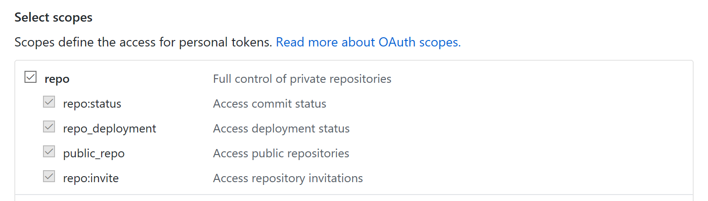
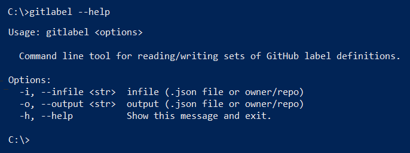
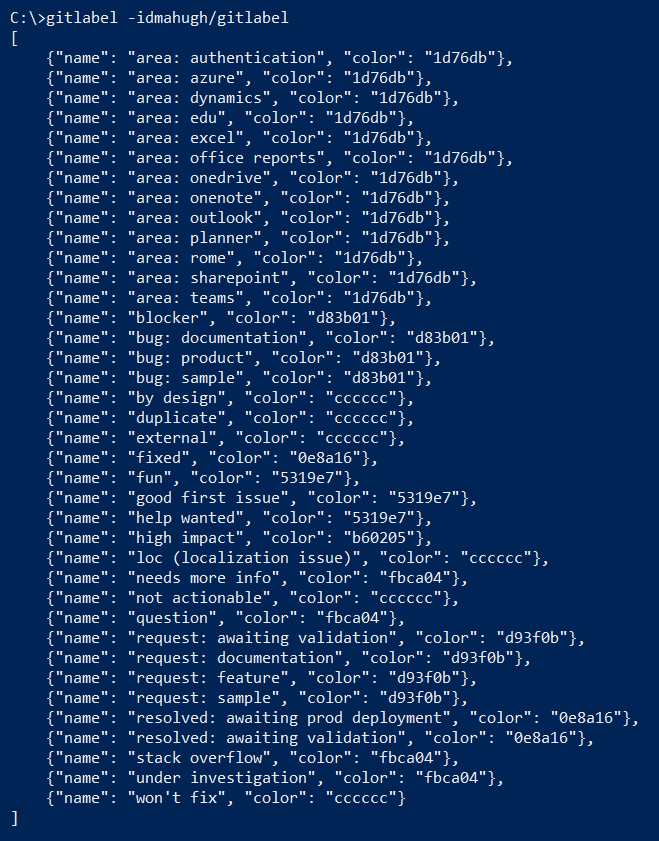
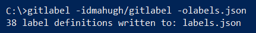
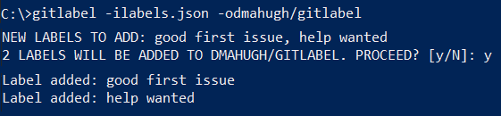

# gitlabel - CLI for managing GitHub labels

Gitlabel is a simple command line tool to help in managing sets of GitHub label definitions. The GitHub web UI provides a way to edit the labels for a repo ([example](https://github.com/dmahugh/gitlabel/labels)), but the defined set of labels only applies to a single repo. Gitlabel provides functionality for reading and writing sets of label definitions, by using Python to call the [GitHub labels API](https://developer.github.com/v3/issues/labels/).

With gitlabel, you can do these things:

* Read a set of label definitions (name/color settings) from either a GitHub owner/repo or a local .JSON file
* Write a set of label definitions to a GitHub repo, a local JSON file, or to the console

This tool is _simple_, so here are a couple of things to be aware of:

* If a same-named label already exists in the target repo, its color is not updated. One _new_ labels are added.
* If the output is a .JSON file, it is overwritten without warning.

# Installation

Gitlabel uses these packages:
* [Click](http://click.pocoo.org/) version 6.7 or above
* [Requests](http://docs.python-requests.org/en/master/) version 2.18.1 or above

To install gitlabel on a Windows 10, Linux, or Mac OS X machine:
* Install the latest version of Python from the Download page at [python.org](https://www.python.org/) and check the "add Python to path" option.
* Clone this repo or download as a ZIP file and un-zip into a folder.
* In the folder containing the repo: ```pip install .```
* If you'd like to make changes to the code later and immediately see them in the command-line behavior, install with ```pip install --editable .``` instead.

## Configuring Authentication

Gitlabel uses a GitHub personal access token (PAT) to authenticte for calls to the GitHub V3 API. A PAT allows the gitlabel application to work with GitHub on your behalf, so gitlabel will have the same rights that you have in GitHub. For example, you'll be able to write label definitions to your own repos, but not to my repos. You can read label definitions from any public repo.

To obtain a PAT, see GitHub's documentation on [Creating a token](https://help.github.com/articles/creating-a-personal-access-token-for-the-command-line/#creating-a-token). Give the token ```repo``` scope by selecting that option:



Gitlabel reads your username and PAT from a ```github.ini``` file that you'll need to create, which should look like this:

```INI
[defaults]
github_user = your_github_user_name

[your_github_user_name]
pat = your_personal_access_token
```

There is a github.ini template file in this repo, which you can edit to add your username and PAT.

To avoid accidental uploading of that confidential information to GitHub, the ```github.ini``` file is stored in a folder named ```_private``` under the _parent folder_ of the repo where gitlabel is installed. After you've set up your github.ini in the root folder of your cloned repo, use these commands to move it to that location:

```DOS
md ..\_private
move github.ini ..\_private
```

Once you've done that, you're ready to run gitlabel from the command prompt. You can run it in any folder, and it will find the auth configuration by looking for ```..\_private\github.ini``` relative to the install folder.

To verify your configuration and installation, try displaying the help screen with the ```gitlabel --help``` command:



# Usage

The basic concept is that gitlabel reads a set of definitions from an _input_ and then writes that set of label definitions to an _output_. The input and output can be either a local JSON file (which must have a ```.json``` extension) or a GitHub repo.

The input argument (-i or --infile) is required, but the output argument is optional. If no output argument is specified, the label definitions are displayed on the console.

GitHub repos (for input or output) are identified by a /-delimited string containing ```org/repo```. For example, this repo would be identified as ```dmahugh/gitlabel```. To read the label definitions from this repo and list them on the console, use the command ```gitlabel -idmahugh/gitlabel```. Here's an example of the output:



To write the output to a local file named ```labels.json```, use this command:



To write a set of label definitions to a repo, use the ```-oorg/repo``` output argument. For example, here's what happens after I delete two of the labels from my repo and then write the saved ```labels.json``` back to it:


